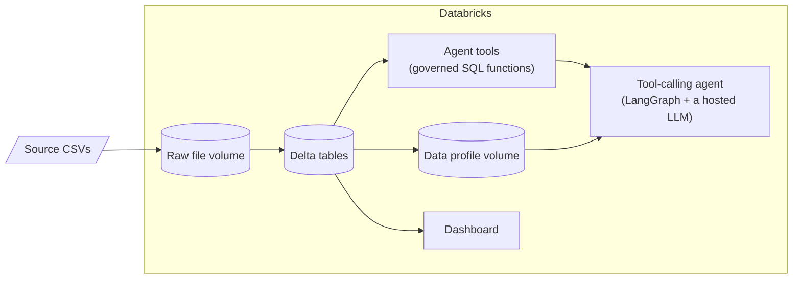

# Databricks Agent Experiments

[](https://github.com/prashanth-ds-ml/databricks-agent-experiments/actions/workflows/ci.yml)
[](LICENSE)


Hands-on exploration of what it actually takes to put an AI agent in front
of a data platform: not just calling an LLM, but giving it governed tools,
trustworthy data underneath it, and a way to see what it's doing.

Two small business datasets (a plant/garden retailer's sales data, and a
candy distributor's sales data) get carried through the same pipeline --
ingestion, data profiling, a dashboard, and a tool-calling agent -- once
built by hand for the first dataset, and once built generically so it
works on the second dataset without any new code.

## Why this exists

Most "build an AI agent" tutorials start from a clean CSV and skip
straight to the LLM. In a real data engineering setting, the interesting
problems are earlier: how does data get into a governed table in the
first place, how do you know what's actually in it before you let an
agent near it, and how do you give an agent tools that can't do more
damage than a read-only SQL query? This repo is a working answer to those
questions, using Databricks as the platform.

## What's inside



| Folder | What it is |
|---|---|
| [`sales/`](sales/) | The original dataset (6 CSVs) plus two parallel ingestion paths: a local MySQL copy, and a Databricks copy with a hand-built agent (see [`sales/databricks_agent/`](sales/databricks_agent/)) |
| [`agent_toolkit/`](agent_toolkit/) | The generalized version -- point it at any folder of CSVs and it builds the tables, a data profile, a dashboard, a plain-English summary, and a tool-calling agent automatically. Proven on a second, unrelated dataset ([`US+Candy+Distributor/`](US+Candy+Distributor/)) with zero code changes |
| [`knowledge_assistant/`](knowledge_assistant/) | Unstructured-data counterpart: turns an uploaded PDF into something question-answerable, two ways -- a billed pipeline (Vector Search + a Databricks-hosted LLM, with a LangGraph agent standing in for Agent Bricks' Knowledge Assistant, which hit a platform bug in testing) and a free pipeline (local Hugging Face embeddings + a small local chat model, no billed services). Also includes a presentation notebook with an interactive plot of the embedding space, for explaining how RAG works rather than just running it. Includes a beginner-friendly [tutorial](knowledge_assistant/TUTORIAL.md) for teaching the workflow to someone new |
| [`docs/COMPONENTS.md`](docs/COMPONENTS.md) | What each Databricks piece used here actually is, in plain language, and why it matters when you're building agents on top of real data |

## The two builds, side by side

| | `sales/databricks_agent/` | `agent_toolkit/` |
|---|---|---|
| Tools | 5: 4 hand-written SQL functions (`top_selling_products`, `low_stock_products`, ...) + 1 Python tool for cached profile stats | 5 generic (`list_tables`, `run_readonly_sql`, `top_n_group_by`, ...) |
| Works on a new dataset | No -- tools are written against specific column names | Yes -- proven on a second dataset, same code |
| Answer quality | Higher -- each tool encodes real business logic | Lower -- the agent has to figure out which table/column fits a question itself |
| Dashboard | Hand-designed charts | Auto-generated from whatever the data profile finds |

Neither approach is "better" -- they're a genuine trade-off between
curation and portability, and seeing both side by side is more useful
than picking one.

## Try it

```powershell
pip install -r requirements.txt   # only pymysql (MySQL loader) + pytest (tests) -- everything else is stdlib
```

You'll need the [Databricks CLI](https://docs.databricks.com/en/dev-tools/cli/index.html)
authenticated against your own workspace (`databricks auth login`), and a
SQL warehouse. Point the scripts at them without editing any code:

```powershell
$env:DATABRICKS_CLI_PROFILE = "<your ~/.databrickscfg profile, or leave unset for DEFAULT>"
$env:DATABRICKS_WAREHOUSE_ID = "<your SQL warehouse id>"
```

Both agents run as Databricks notebooks. The toolkit side is also
runnable from a terminal:

```powershell
cd agent_toolkit
python setup.py --config configs/candy_distributor.json --dry-run   # preview, no changes
python setup.py --config configs/candy_distributor.json             # ingest -> profile -> dashboard -> summary -> questions
```

Then open `generic_agent_notebook.py` in Databricks, point its
`catalog`/`schema` widgets at your data, and ask it questions.

The pure logic (no Databricks needed) has its own test suite:

```powershell
pytest agent_toolkit/tests/ -v
```

## Status

Working end to end and verified by actually running it (not just reading
the code): both agents answer real questions correctly, the generic
pipeline has been proven on a second dataset, and the dashboard/profiler
outputs have been spot-checked against the source data. The pure logic
(identifier sanitization, file discovery, chart/question selection) also
has a real test suite (`agent_toolkit/tests/`, 50 tests) checked on every
push by CI -- it can't touch Databricks itself from a public runner, but
it did catch two real bugs during development.

Retrieval/RAG over documentation is done: `knowledge_assistant/` builds a
Vector Search index from an uploaded PDF and answers questions from it
with a LangGraph agent, verified end to end with a real PDF and a real
Databricks job run (see that folder's README for the full verification
trail, including a platform-side Agent Bricks Knowledge Assistant bug
found and worked around along the way).

Other open ends, if you want to pick one up: an evaluation set for the
agents' answers, wrapping any of the three agents for deployment as a
callable endpoint, merging the knowledge assistant's retriever tool into
the sales agent so one agent answers both structured and unstructured
questions, or trying a low-code alternative (Databricks Genie) as a
comparison point.
