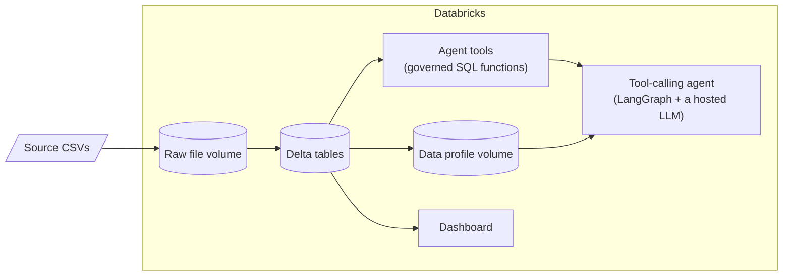

# Databricks Agent Experiments

Hands-on exploration of what it actually takes to put an AI agent in front
of a data platform: not just calling an LLM, but giving it governed tools,
trustworthy data underneath it, and a way to see what it's doing.

Two small business datasets (a plant/garden retailer's sales data, and a
candy distributor's sales data) get carried through the same pipeline --
ingestion, data profiling, a dashboard, and a tool-calling agent -- once
built by hand for the first dataset, and once built generically so it
works on the second dataset without any new code.

## Why this exists

Most "build an AI agent" tutorials start from a clean CSV and skip
straight to the LLM. In a real data engineering setting, the interesting
problems are earlier: how does data get into a governed table in the
first place, how do you know what's actually in it before you let an
agent near it, and how do you give an agent tools that can't do more
damage than a read-only SQL query? This repo is a working answer to those
questions, using Databricks as the platform.

## What's inside



| Folder | What it is |
|---|---|
| [`sales/`](sales/) | The original dataset (6 CSVs) plus two parallel ingestion paths: a local MySQL copy, and a Databricks copy with a hand-built agent (see [`sales/databricks_agent/`](sales/databricks_agent/)) |
| [`agent_toolkit/`](agent_toolkit/) | The generalized version -- point it at any folder of CSVs and it builds the tables, a data profile, a dashboard, a plain-English summary, and a tool-calling agent automatically. Proven on a second, unrelated dataset ([`US+Candy+Distributor/`](US+Candy+Distributor/)) with zero code changes |
| [`docs/COMPONENTS.md`](docs/COMPONENTS.md) | What each Databricks piece used here actually is, in plain language, and why it matters when you're building agents on top of real data |

## The two builds, side by side

| | `sales/databricks_agent/` | `agent_toolkit/` |
|---|---|---|
| Tools | 4 hand-written, named (`top_selling_products`, `low_stock_products`, ...) | 5 generic (`list_tables`, `run_readonly_sql`, `top_n_group_by`, ...) |
| Works on a new dataset | No -- tools are written against specific column names | Yes -- proven on a second dataset, same code |
| Answer quality | Higher -- each tool encodes real business logic | Lower -- the agent has to figure out which table/column fits a question itself |
| Dashboard | Hand-designed charts | Auto-generated from whatever the data profile finds |

Neither approach is "better" -- they're a genuine trade-off between
curation and portability, and seeing both side by side is more useful
than picking one.

## Try it

Both agents run as Databricks notebooks. The toolkit side is also
runnable from a terminal:

```powershell
cd agent_toolkit
python setup.py --config configs/candy_distributor.json --dry-run   # preview, no changes
python setup.py --config configs/candy_distributor.json             # ingest -> profile -> dashboard -> summary -> questions
```

Then open `generic_agent_notebook.py` in Databricks, point its
`catalog`/`schema` widgets at your data, and ask it questions.

## Status

Working end to end and verified by actually running it (not just reading
the code): both agents answer real questions correctly, the generic
pipeline has been proven on a second dataset, and the dashboard/profiler
outputs have been spot-checked against the source data.

Open ends, if you want to pick one up: adding retrieval/RAG over
documentation, an evaluation set for the agents' answers, wrapping either
agent for deployment as a callable endpoint, or trying a low-code
alternative (Databricks Genie) as a comparison point.
