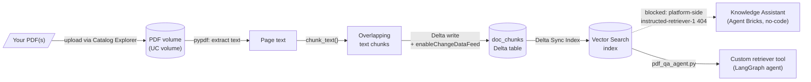

# PDF Knowledge Assistant

- Takes PDF(s) uploaded to a Unity Catalog volume and makes them
  question-answerable, via **two independent pipelines** with a real
  cost trade-off -- see the comparison below.
- **Billed pipeline** (governed, production-shaped):
  - [`pdf_to_vector_index.py`](pdf_to_vector_index.py) -- PDF -> chunks
    -> Delta table -> **Databricks Vector Search** index.
  - [`pdf_qa_agent.py`](pdf_qa_agent.py) -- a LangGraph tool-calling
    agent answering from that index, using a Databricks-hosted LLM.
- **Free pipeline** (no billed services beyond the cluster you already
  need):
  - [`free_pdf_to_embeddings.py`](free_pdf_to_embeddings.py) -- PDF ->
    chunks -> Delta table with locally-computed embeddings, no Vector
    Search endpoint.
  - [`free_pdf_qa.py`](free_pdf_qa.py) -- plain numpy cosine-similarity
    search plus a small local Hugging Face model for answers, no
    Databricks-hosted LLM calls.
- **Want to explain *how* it works, not just use it?**
  [`rag_concepts_demo.py`](rag_concepts_demo.py) is a presentation
  notebook (not a pipeline) -- run it live to walk someone through
  chunking, an interactive plot of the embedding space (similar chunks
  visibly cluster; a real question shows up as a point connected to the
  chunks it retrieves), retrieval metadata, a full question-to-answer
  run, and a concrete list of levers to improve accuracy further. Built
  on the free pipeline's data, zero billed services.
- Plain-language, step-by-step version for teaching this to someone new:
  [`TUTORIAL.md`](TUTORIAL.md).
- Structured/unstructured counterpart to [`sales/databricks_agent/`](../sales/databricks_agent/)
  and [`agent_toolkit/`](../agent_toolkit/) -- those put a tool-calling
  agent in front of Delta tables; this puts retrieval in front of
  documents.

## The two pipelines, side by side

| | Billed (`pdf_to_vector_index.py` + `pdf_qa_agent.py`) | Free (`free_pdf_to_embeddings.py` + `free_pdf_qa.py`) |
|---|---|---|
| Embeddings | Databricks-hosted (`databricks-gte-large-en`) or local HF | Local Hugging Face only (`all-MiniLM-L6-v2`) |
| Search | Databricks Vector Search index (governed UC object, ANN search) | Plain numpy cosine similarity over a Delta table, driver-side |
| Answer generation | Databricks-hosted LLM (`databricks-meta-llama-3-3-70b-instruct` by default) via a LangGraph tool-calling agent | Small local Hugging Face model (`Qwen2.5-*-Instruct`), fixed retrieve-then-generate pipeline |
| What keeps costing money after the notebook finishes | The Vector Search endpoint, until deleted | Nothing -- only storage for the Delta table |
| Scales to a large document library | Yes -- that's what Vector Search is for | No -- everything is loaded onto the driver |
| Compatible with Agent Bricks Knowledge Assistant | Yes in principle (blocked by the platform bug below in practice) | No |
| Answer quality | Higher -- a much larger model | Lower -- a small model, CPU-friendly by design |

Neither is "better" -- same trade-off philosophy as the two sales agents
in this repo: pick the free pipeline for learning/demoing without
worrying about a running bill, the billed one when you actually need
retrieval that scales or the best answer quality.

## Architecture

- Two embedding paths, chosen with the notebook's `embedding_source`
  widget:
  - `databricks` (default) -- a Databricks Foundation Model endpoint
    (`databricks-gte-large-en`) computes embeddings during the Vector
    Search sync itself; nothing to install or run locally.
  - `huggingface` -- `sentence-transformers` (`all-MiniLM-L6-v2` by
    default) computes embeddings on the cluster before the sync; a
    **self-managed embeddings** index instead of a Databricks-computed
    one.

## Where things live

| What | Where |
|---|---|
| Indexing notebook (billed) | `pdf_to_vector_index.py` |
| Q&A agent notebook (billed) | `pdf_qa_agent.py` |
| Embeddings notebook (free) | `free_pdf_to_embeddings.py` |
| Q&A notebook (free) | `free_pdf_qa.py` |
| Presentation notebook | `rag_concepts_demo.py` |
| Tutorial | `TUTORIAL.md` |
| PDF volume | `<catalog>.<schema>.<pdf_volume>` (default: `workspace.knowledge_assistant.source_docs`, shared by both pipelines) |
| Chunks table (billed) | `<catalog>.<schema>.<chunks_table>` (default: `workspace.knowledge_assistant.doc_chunks`) |
| Chunks table (free) | `<catalog>.<schema>.<chunks_table>` (default: `workspace.knowledge_assistant.doc_chunks_free`) |
| Vector Search endpoint (billed only) | name set by the `vs_endpoint` widget (default: `knowledge_assistant_vs`) |
| Vector Search index (billed only) | `<catalog>.<schema>.<vs_index_name>` (default: `workspace.knowledge_assistant.doc_chunks_index`) |

## Decisions worth remembering

- **Delta Sync Index, not Direct Access Index.** A Delta Sync Index stays
  wired to the source Delta table and re-syncs with one `.sync()` call;
  a Direct Access Index would mean pushing/upserting vectors by hand on
  every change. The former fits "re-run the notebook after uploading more
  PDFs" much better.
- **`pipeline_type="TRIGGERED"`, not `"CONTINUOUS"`.** This notebook is
  run by hand, not on a schedule -- triggered sync (only updates when
  `.sync()` is called) avoids paying for a continuously-running pipeline
  that would otherwise sit idle between runs.
- **`delta.enableChangeDataFeed` must be set on the chunks table.** Vector
  Search's Delta Sync Index reads the table's change feed to know what's
  new since the last sync; index creation fails without it.
- **Driver-side embedding computation for the Hugging Face path**, not a
  pandas UDF. Fine for a handful of PDFs on a single cluster; a real
  large-corpus pipeline would want to parallelize this -- left as-is here
  to keep the notebook a straight top-to-bottom walkthrough rather than a
  scaled-up pipeline.
- **An index's embedding source is fixed at creation.** Switching the
  `embedding_source` widget after the index already exists requires
  deleting and recreating the index (`vsc.delete_index(...)`) -- there's
  no in-place "change embedding model" operation.
- **The free pipeline isn't a LangGraph agent.** Small open-weight
  models (the CPU-friendly sizes this notebook defaults to) are
  unreliable at the structured tool-calling format LangGraph's ReAct
  agent depends on. Since there's only ever one thing to do anyway
  (retrieve, then answer from what was retrieved), a fixed pipeline is
  both simpler and more robust than forcing an agentic loop onto a model
  too small to use one reliably.
- **The free pipeline's retrieval doesn't scale past the driver's
  memory** -- `toPandas()` pulls every chunk onto one machine to score
  with numpy. Fine for a PDF or two; a real document library needs an
  actual index (Vector Search, or a local library like FAISS), which is
  exactly the cost/capability trade the billed pipeline makes.
- **The PDF upload step is manual, on purpose.** Everything else in this
  notebook is scripted/idempotent, but there's no way to script "which
  PDF do you want indexed" -- Catalog Explorer's upload UI is the
  documented one-time step per new PDF.

## Status

Working end to end, verified by actually running it against a real PDF
(a RAG research paper) in the `academy` workspace, not just by reading
the code:

- `pdf_to_vector_index.py`: ran the full pipeline for real -- 91 chunks
  extracted and indexed, Delta Sync Index created with Databricks-computed
  embeddings (`databricks-gte-large-en`). Confirmed healthy by querying
  the index directly (`databricks vector-search-indexes query-index`)
  and getting back real, relevant passages with sensible similarity
  scores.
- **Agent Bricks Knowledge Assistant hit a platform-side bug**, not
  something in this repo: pointing a Knowledge Assistant at the
  (confirmed-healthy) index failed with `ENDPOINT_NOT_FOUND` on an
  internal Databricks-managed model, `instructed-retriever-1`. Checked
  via the CLI's `knowledge-assistants` command group -- config was
  correct (single source, state `UPDATED`, endpoint `READY`) -- the
  failing model isn't visible or configurable from this workspace at
  all, so this needs Databricks support, not a code fix.
- `pdf_qa_agent.py` (a from-scratch LangGraph agent wrapping the same
  index as a tool, using `databricks-meta-llama-3-3-70b-instruct`) was
  built as a working alternative and **submitted as a real Databricks
  job run** -- completed with `result_state: SUCCESS`, no errors, in
  ~103 seconds including a cold cluster start.
- **Added a fully free pipeline** (`free_pdf_to_embeddings.py` +
  `free_pdf_qa.py`) after deciding the ongoing Vector Search endpoint
  cost wasn't worth it for a learning/demo project: local Hugging Face
  embeddings, plain numpy cosine similarity, and a small local Hugging
  Face chat model -- no Vector Search endpoint, no pay-per-token model
  calls. **Submitted as a real two-task Databricks job run**
  (`free_pdf_to_embeddings` -> `free_pdf_qa`, chained via `depends_on`)
  against the same PDF used to verify the billed pipeline -- both tasks
  `SUCCESS`.
- **Both Vector Search endpoints deleted** (`knowledge_assistant_vs` and
  `ka-5918c3d8-vs-endpoint`, the latter auto-created by Agent Bricks
  itself while testing the Knowledge Assistant) -- confirmed via
  `vector-search-endpoints list-endpoints` returning empty. Nothing in
  this project bills anything, currently.
- **Decided against retrying Agent Bricks Knowledge Assistant for now.**
  It would mean recreating the billed endpoint just to very likely hit
  the same platform-side `instructed-retriever-1` bug again. `free_pdf_qa.py`
  is the recommended way to ask questions of the PDF until/unless there's
  a specific reason to need Vector Search or the no-code Knowledge
  Assistant experience again.

- **`rag_concepts_demo.py`** (a presentation notebook, not a pipeline)
  was built for explaining/teaching the free pipeline rather than running
  it -- chunking demo, an interactive Plotly embedding-space plot
  (PCA + KMeans, hoverable, with a live query plotted against real
  retrieved chunks), retrieval + metadata, a full Q&A run, and an
  improvement-levers table. **Submitted as a real job run** --
  `result_state: SUCCESS`.

## Next steps

- If Databricks resolves the `instructed-retriever-1` issue and Agent
  Bricks is worth revisiting, re-run `pdf_to_vector_index.py` to recreate
  the index/endpoint first (they were deleted) before pointing a
  Knowledge Assistant at it again.
- Merge either agent's retriever tool into `sales/databricks_agent/agent_notebook.py`
  (or a new combined notebook) so one agent can answer both structured
  (SQL) and unstructured (PDF) questions.
- If either pipeline grows beyond a couple of PDFs, the free one needs a
  real index instead of driver-side numpy (see "Decisions" above), and
  the billed one might want `pipeline_type="CONTINUOUS"` instead of
  `TRIGGERED` for a continuously-synced index.
