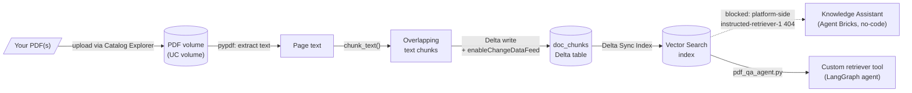

# PDF Knowledge Assistant

- Takes PDF(s) uploaded to a Unity Catalog volume and turns them into a
  **Databricks Vector Search** index: chunked, embedded, governed, and
  queryable -- the piece a Databricks **Knowledge Assistant** (Agent
  Bricks) or a custom RAG tool sits on top of.
- Two notebooks:
  - [`pdf_to_vector_index.py`](pdf_to_vector_index.py) -- PDF -> chunks
    -> Delta table -> Vector Search index. Designed to be re-run top to
    bottom (`Run All`) any time; see its own intro cell for the full
    smooth-start checklist and prerequisites.
  - [`pdf_qa_agent.py`](pdf_qa_agent.py) -- a LangGraph tool-calling
    agent that answers questions from that index directly, without Agent
    Bricks (see "Status" below for why).
- Plain-language, step-by-step version for teaching this to someone new:
  [`TUTORIAL.md`](TUTORIAL.md).
- Structured/unstructured counterpart to [`sales/databricks_agent/`](../sales/databricks_agent/)
  and [`agent_toolkit/`](../agent_toolkit/) -- those put a tool-calling
  agent in front of Delta tables; this puts retrieval in front of
  documents.

## Architecture

- Two embedding paths, chosen with the notebook's `embedding_source`
  widget:
  - `databricks` (default) -- a Databricks Foundation Model endpoint
    (`databricks-gte-large-en`) computes embeddings during the Vector
    Search sync itself; nothing to install or run locally.
  - `huggingface` -- `sentence-transformers` (`all-MiniLM-L6-v2` by
    default) computes embeddings on the cluster before the sync; a
    **self-managed embeddings** index instead of a Databricks-computed
    one.

## Where things live

| What | Where |
|---|---|
| Indexing notebook | `pdf_to_vector_index.py` |
| Q&A agent notebook | `pdf_qa_agent.py` |
| Tutorial | `TUTORIAL.md` |
| PDF volume | `<catalog>.<schema>.<pdf_volume>` (default: `workspace.knowledge_assistant.source_docs`) |
| Chunks table | `<catalog>.<schema>.<chunks_table>` (default: `workspace.knowledge_assistant.doc_chunks`) |
| Vector Search endpoint | name set by the `vs_endpoint` widget (default: `knowledge_assistant_vs`) |
| Vector Search index | `<catalog>.<schema>.<vs_index_name>` (default: `workspace.knowledge_assistant.doc_chunks_index`) |

## Decisions worth remembering

- **Delta Sync Index, not Direct Access Index.** A Delta Sync Index stays
  wired to the source Delta table and re-syncs with one `.sync()` call;
  a Direct Access Index would mean pushing/upserting vectors by hand on
  every change. The former fits "re-run the notebook after uploading more
  PDFs" much better.
- **`pipeline_type="TRIGGERED"`, not `"CONTINUOUS"`.** This notebook is
  run by hand, not on a schedule -- triggered sync (only updates when
  `.sync()` is called) avoids paying for a continuously-running pipeline
  that would otherwise sit idle between runs.
- **`delta.enableChangeDataFeed` must be set on the chunks table.** Vector
  Search's Delta Sync Index reads the table's change feed to know what's
  new since the last sync; index creation fails without it.
- **Driver-side embedding computation for the Hugging Face path**, not a
  pandas UDF. Fine for a handful of PDFs on a single cluster; a real
  large-corpus pipeline would want to parallelize this -- left as-is here
  to keep the notebook a straight top-to-bottom walkthrough rather than a
  scaled-up pipeline.
- **An index's embedding source is fixed at creation.** Switching the
  `embedding_source` widget after the index already exists requires
  deleting and recreating the index (`vsc.delete_index(...)`) -- there's
  no in-place "change embedding model" operation.
- **The PDF upload step is manual, on purpose.** Everything else in this
  notebook is scripted/idempotent, but there's no way to script "which
  PDF do you want indexed" -- Catalog Explorer's upload UI is the
  documented one-time step per new PDF.

## Status

Working end to end, verified by actually running it against a real PDF
(a RAG research paper) in the `academy` workspace, not just by reading
the code:

- `pdf_to_vector_index.py`: ran the full pipeline for real -- 91 chunks
  extracted and indexed, Delta Sync Index created with Databricks-computed
  embeddings (`databricks-gte-large-en`). Confirmed healthy by querying
  the index directly (`databricks vector-search-indexes query-index`)
  and getting back real, relevant passages with sensible similarity
  scores.
- **Agent Bricks Knowledge Assistant hit a platform-side bug**, not
  something in this repo: pointing a Knowledge Assistant at the
  (confirmed-healthy) index failed with `ENDPOINT_NOT_FOUND` on an
  internal Databricks-managed model, `instructed-retriever-1`. Checked
  via the CLI's `knowledge-assistants` command group -- config was
  correct (single source, state `UPDATED`, endpoint `READY`) -- the
  failing model isn't visible or configurable from this workspace at
  all, so this needs Databricks support, not a code fix.
- `pdf_qa_agent.py` (a from-scratch LangGraph agent wrapping the same
  index as a tool, using `databricks-meta-llama-3-3-70b-instruct`) was
  built as a working alternative and **submitted as a real Databricks
  job run** -- completed with `result_state: SUCCESS`, no errors, in
  ~103 seconds including a cold cluster start. This is the currently
  recommended path until the Agent Bricks issue is resolved.

## Next steps

- If Databricks resolves the `instructed-retriever-1` issue, try the
  Knowledge Assistant path again -- no changes needed to the index itself.
- Add `pdf_qa_agent.py`'s retriever tool to `sales/databricks_agent/agent_notebook.py`
  (or a new combined notebook) so one agent can answer both structured
  (SQL) and unstructured (PDF) questions.
- If this grows beyond a couple of PDFs, revisit driver-side Hugging Face
  embedding (see "Decisions" above) and `pipeline_type` for a
  continuously-synced index.
