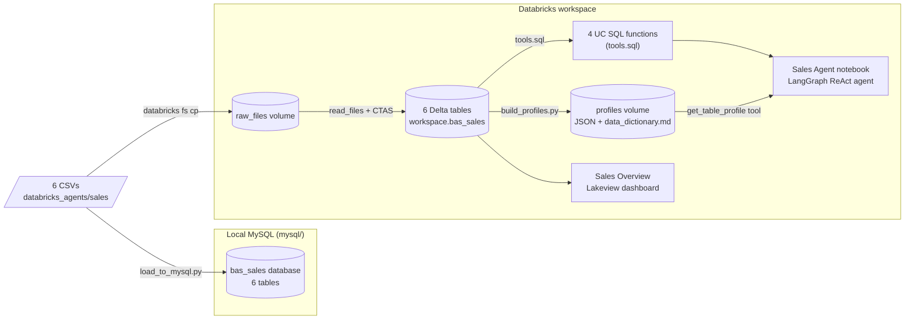

# Sales Agent

- A tool-calling AI agent over a small sales dataset, built end to end:
  local CSVs -> MySQL (local) + Databricks (Delta tables, dashboard, agent)
- This document is the full history of how it was built, in order
- The agent notebook itself (`agent_notebook.py`) assumes everything below
  already exists and picks up from "tables + tools are ready"

## Source data

- Six CSVs in `databricks_agents/sales/`: `categories`, `suppliers`, `customers`,
  `products`, `orders`, `order_items`
- A small relational schema for a plant/garden retailer: 8 categories, 6
  suppliers, 20 customers, 24 products, 24 orders, 48 order items

## Architecture



- MySQL and Databricks are two **independent** copies of the same source
  data -- not federated together
- Deliberate choice: networking local MySQL to cloud Databricks would mean
  exposing this machine's database to the internet, which wasn't worth it
  for a sample dataset -- see "Decisions" below

## Steps, in order

### 1. MySQL ingestion (local)
- `mysql/schema.sql` -- creates the `bas_sales` database and 6 tables with
  primary/foreign keys matching the CSVs.
- `mysql/load_to_mysql.py` -- loads the CSVs into those tables in
  FK-safe order (categories/suppliers -> products/customers -> orders ->
  order_items), using `pymysql`, converting `true`/`false` strings and
  blank strings to proper `NULL`s.
- Credentials are read from the `MYSQL_PWD` environment variable so a
  password is never typed into a chat or committed to a file:
  ```powershell
  mysql -u root -p < mysql/schema.sql
  $env:MYSQL_PWD = "<your-mysql-password>"
  python mysql/load_to_mysql.py
  ```

### 2. Databricks CLI setup
- Databricks CLI (`databricks.exe`, installed via winget) authenticated
  against the workspace `dbc-181e284b-0bf0.cloud.databricks.com` using an
  existing OAuth profile named `academy` in `~/.databrickscfg`.
- All subsequent steps run through this CLI (`databricks api`,
  `databricks fs`, `databricks workspace`, `databricks jobs`, etc.) rather
  than the web UI, so they're scripted and reproducible.

### 3. Load data into Databricks
- Created schema `workspace.bas_sales` and a managed Unity Catalog volume
  `workspace.bas_sales.raw_files`.
- Uploaded all 6 CSVs into that volume (`databricks fs cp`).
- Created 6 Delta tables (`workspace.bas_sales.{categories, suppliers,
  customers, products, orders, order_items}`) via `CREATE OR REPLACE TABLE
  ... AS SELECT * FROM read_files(...)`, run through the SQL Statement
  Execution API against the workspace's serverless SQL warehouse.
- Verified row counts match the source CSVs exactly.

### 4. Data profiler (`build_profiles.py` + `db_sql.py`)
- For each of the 6 tables: introspects columns/types via
  `information_schema.columns`, then computes (all via SQL, no Spark
  needed since the tables are small):
  - **Shape**: row count, column count
  - **Every column**: null count/%, distinct count, PK/FK flags
  - **Numerical columns**: min, max, mean, median, stddev
  - **Categorical columns**: top-10 value counts (or a "high cardinality"
    note above 50 distinct values, e.g. for email/phone-like columns)
  - **Temporal columns**: min/max date range
- Writes one JSON file per table plus a combined `data_dictionary.md`,
  uploads both to a new UC volume `workspace.bas_sales.profiles`.
- Rerun any time the data changes: `python build_profiles.py`.

### 5. Agent tools (`tools.sql`)
- Four Unity Catalog SQL functions
- Each a governed, reusable function whose own `COMMENT`s (on the function
  and its parameters) double as the tool description an LLM reads to
  decide when/how to call it

| Function | Parameters | Returns |
|---|---|---|
| `top_selling_products(n)` | `n` (default 5) | Top N products by revenue, joined with category |
| `customer_order_history(cust_id)` | `cust_id` | That customer's orders: date, status, item count, total |
| `low_stock_products()` | none | Non-discontinued products at/below reorder level, with supplier |
| `monthly_revenue()` | none | Revenue + order count grouped by calendar month |

### 6. Dashboard ("Sales Overview")
- A Lakeview (AI/BI) dashboard created directly via the Lakeview REST API
  (hand-built JSON spec: 5 datasets, 7 widgets -- 3 counters, a line chart,
  2 bar charts, a table), published against the same SQL warehouse
- Not part of the agent -- a separate, human-facing view over the same
  tables

### 7. Agent (`agent_notebook.py`)
- See the notebook itself for the full breakdown -- it documents each step
  inline, including two rendered Mermaid diagrams
- In short:
- **LLM**: `ChatDatabricks` calling the `databricks-meta-llama-3-3-70b-instruct`
  pay-per-token foundation model endpoint.
- **Tools**: the 4 UC SQL functions above (auto-converted to LangChain tools
  by `UCFunctionToolkit`, which reads their name/params/comments directly
  from Unity Catalog) plus a 5th tool, `get_table_profile`, which is a plain
  Python/LangChain `@tool` (not a UC function, since it needs a file read)
  that returns the cached JSON from step 4 instead of recomputing stats.
- **Orchestration**: LangGraph's prebuilt `create_react_agent` -- the LLM
  decides which tool(s) to call, reads the result, and can loop (call
  another tool) before producing a final answer.
- Verified end to end by running the notebook as a Databricks job
  (`databricks jobs submit`) rather than manually in the UI, so every
  change described here was actually executed, not just written.

## Where things live

| What | Where |
|---|---|
| MySQL scripts | `mysql/schema.sql`, `mysql/load_to_mysql.py` |
| Profiler | `build_profiles.py`, `db_sql.py`, output in `profiles/` (local) |
| Agent tools | `tools.sql` |
| Agent notebook (local copy) | `agent_notebook.py` |
| Agent notebook (Databricks) | `/Users/prashanth01071995@gmail.com/sales_agent/agent_notebook` |
| Delta tables | `workspace.bas_sales.{categories,suppliers,customers,products,orders,order_items}` |
| Raw CSV volume | `workspace.bas_sales.raw_files` |
| Profile cache volume | `workspace.bas_sales.profiles` |
| Dashboard | "Sales Overview" (Lakeview), same workspace |
| Warehouse used throughout | `461364b1c78f2539` ("Serverless Starter Warehouse") |

## Decisions worth remembering

- **MySQL and Databricks are not networked together.** Bridging them
  (Lakehouse Federation / JDBC) would require exposing local MySQL to the
  internet (tunnel, port-forward). For this dataset we chose to load CSVs
  into each independently instead -- simpler, no exposure.
- **`get_table_profile` is a Python tool, not a UC function**, specifically
  so profiling questions read a cheap cached snapshot instead of
  recomputing stats via SQL on every question.
- **`langgraph` and `langgraph-prebuilt` must be version-pinned together**
  in the notebook's `%pip install` -- letting pip mix versions raises
  `ImportError: cannot import name 'ExecutionInfo' from 'langgraph.runtime'`
  (a real LangGraph packaging issue, not something specific to this
  project).
- **Databricks `%md` cells do not render Mermaid natively** (that's a
  GitHub/Claude-Artifacts feature). The notebook instead renders diagrams
  via `displayHTML()` + Mermaid.js loaded from a CDN -- and the helper
  function has to be defined *after* the notebook's one
  `dbutils.library.restartPython()` call, since that call wipes the entire
  Python namespace.
